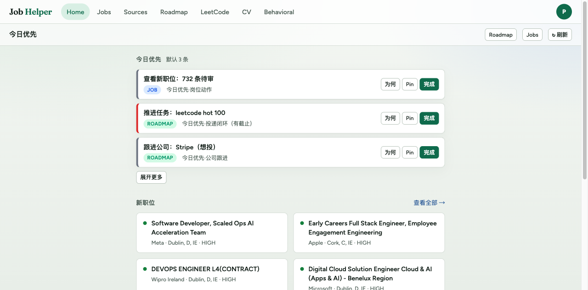
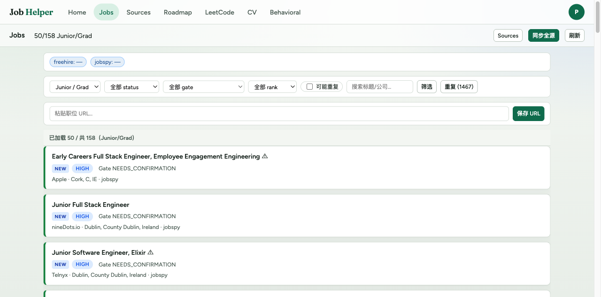
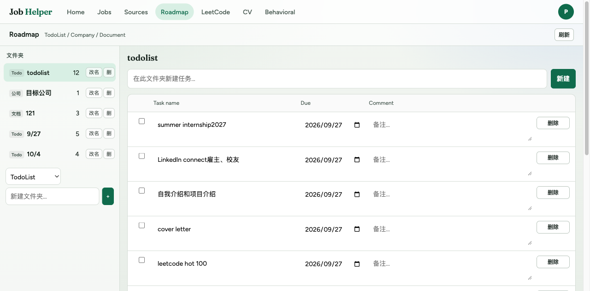
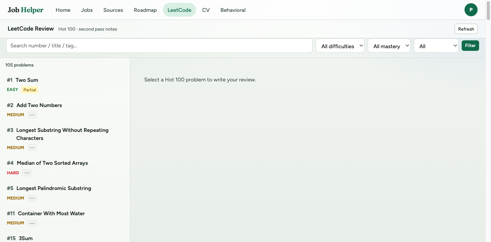
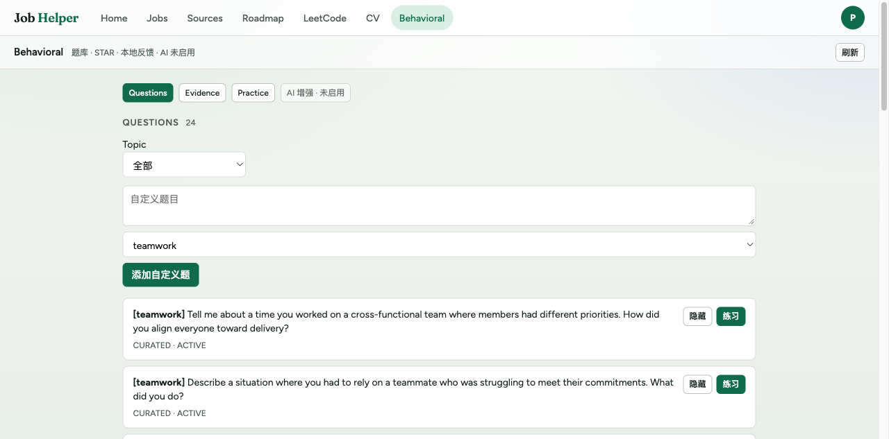
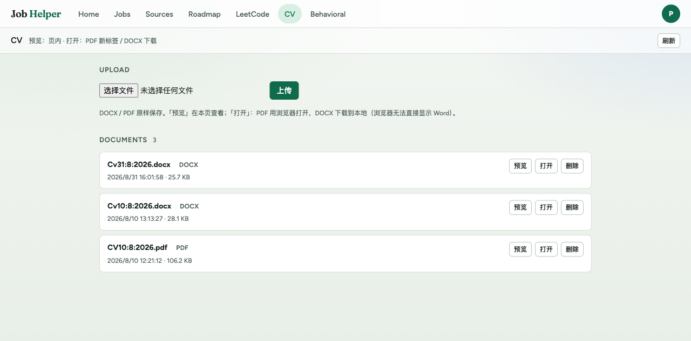

# Job Helper

A personal job-search management app built for the Irish graduate market. Tracks jobs, manages application roadmaps, practises behavioural interview questions, and keeps LeetCode progress — all in one place.

**Tech stack:** Java 21 · Spring Boot · PostgreSQL · Flyway · React · TypeScript · Vite · Docker

---

## Screenshots

| | |
|---|---|
| **Today's priorities** — smart action feed ranked by urgency | **Job board** — scraped listings filtered and ranked by fit |
|  |  |
| **Application roadmap** — per-company todo lists with due dates | **LeetCode tracker** — Hot 100 progress with spaced review |
|  |  |
| **Behavioural prep** — STAR answer bank with local feedback | **CV library** — version-controlled CV file storage |
|  |  |

---

## Features

- **Home feed** — daily priority list combining job actions, roadmap todos, and LeetCode reminders, ranked by urgency band
- **Job discovery** — integrates with FreeHire and JobSpy to scrape Ireland listings; deduplication and gate/rank scoring built in
- **Application roadmap** — per-company task lists with folder organisation, dependency tracking, and due-date ordering
- **LeetCode Hot 100** — fetches problem content, tracks solve status, surfaces problems due for review
- **Behavioural question bank** — curated questions with STAR evidence tagging and local rule-based feedback
- **CV management** — upload and store multiple CV versions (PDF/DOCX)
- **Scheduled sync** — automatic job scraping via cron, weekly backup to zip

---

## Quick start

Requires Docker (no local Java or Node needed).

```bash
docker compose up --build
```

- Frontend: http://localhost:5173
- API: http://localhost:8080/api/v1

To stop and remove all data:

```bash
docker compose down -v
```

---

## Project layout

```
jobAssitant/
  backend/    Spring Boot API — Jobs, Roadmap, LeetCode, Behavioral, CV, Profile
  frontend/   React SPA — Vite + TypeScript
delta/        Specs: requirements → design → coding plan
docs/         Architecture notes and screenshots
docker-compose.yaml
```

---

## Architecture notes

- **Outbox pattern** for reliable event publishing between modules
- **Flyway** database migrations (17 versions)
- **Domain / application / infrastructure layering** per module
- **Gate + Rank scoring** for job fit evaluation with duplicate URL normalisation
